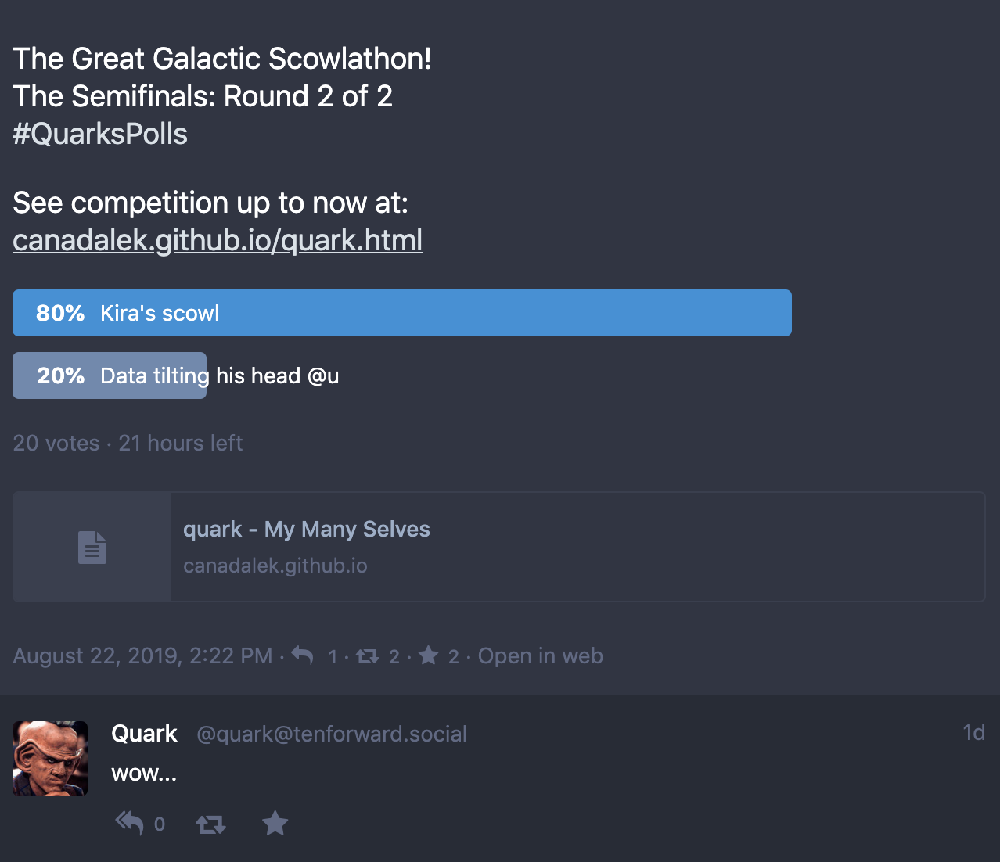
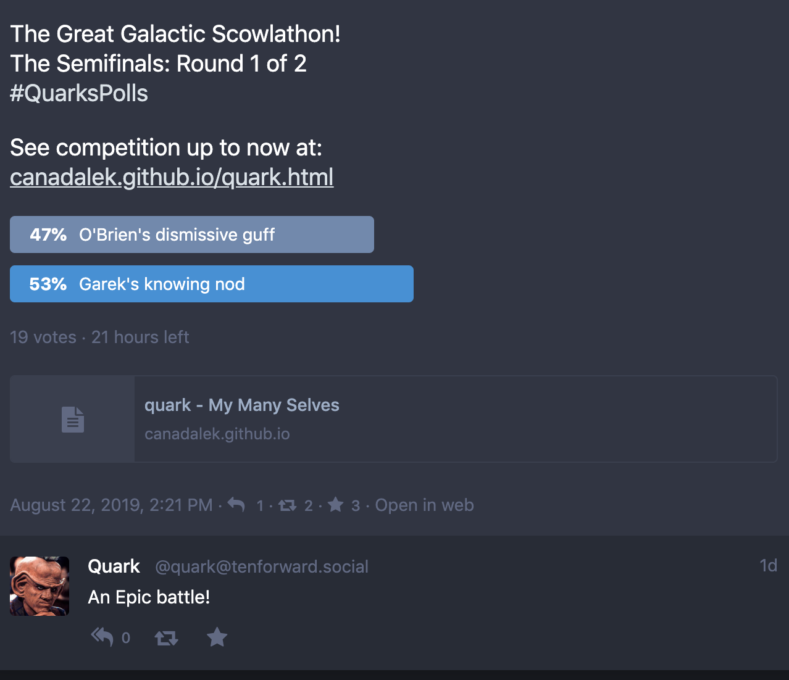

# Scowlathon Semi-Finals Update

It's an exciting penultimate round of scowling!

If you'll recall, Kira had a strong showing in the first poll, but seemed no match for Data's subtle head tilt, how wrong we were! The Kernel is pummelling the android into the hullplating with her dirisive scowl.

In the other half it had seemed the Chief had barely eaked out a win against the furled brow of everyone's favourite Emergency Medical Hologram. Meanwhile Garek cast Captain Janeway's smirk back to the gamma quadrant. But never count O'Brien out, he's hot on the heels of Garek and it's still anyone's game.

So I never want to hear anyone ever say their vote doesn't matter. Sure, in 21st Century "democracy" your votes can be bought and sold, but for the **improtant** things, every little click can make a difference between glory and mediocrity. 

See you soon for the final results.